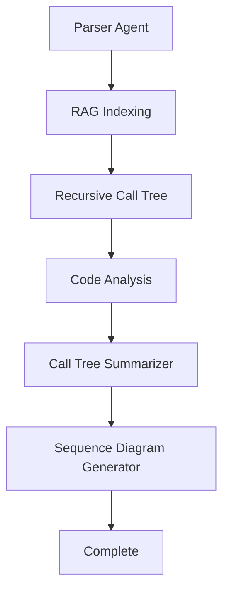

# AutoDiagenti AI v2.0

> Java Spring 프로젝트의 API 흐름을 자동으로 분석하고 시각화하는 AI 기반 도구

[](https://python.org)
[](https://streamlit.io)
[](https://fastapi.tiangolo.com)
[](https://langchain.com)
[](LICENSE)

## 📋 목차

- [프로젝트 개요](#-프로젝트-개요)
- [주요 기능](#-주요-기능)
- [대상 사용자](#-대상-사용자)
- [설치 및 설정](#-설치-및-설정)
- [사용법](#-사용법)
- [API 문서](#-api-문서)
- [아키텍처](#-아키텍처)
- [개발 가이드](#-개발-가이드)
- [기여 방법](#-기여-방법)
- [라이선스](#-라이선스)
- [지원](#-지원)

## 🚀 프로젝트 개요

**AutoDiagenti AI**는 Java Spring Framework 기반 프로젝트의 복잡한 API 호출 흐름을 AI가 자동으로 분석하여 개발자에게 직관적인 시각화와 설명을 제공하는 도구입니다.

### ✨ 주요 기능

- **🔍 자동 API 탐지**: Spring 애노테이션 기반 엔트리포인트 자동 추출
- **🌳 호출 흐름 분석**: 메서드 간 호출 관계를 재귀적으로 분석
- **🖥️ AI 기반 해석**: LLM을 활용한 코드 흐름 해석 및 요약
- **📊 시각화**: Mermaid 시퀀스 다이어그램으로 직관적 표현
- **📋 히스토리 관리**: 분석 결과 저장 및 재조회 기능


### 🎯 대상 사용자

- **Java Spring 개발자**: 복잡한 API 흐름을 이해하고 문서화하고 싶은 개발자
- **시스템 아키텍트**: 전체 시스템 구조를 파악하고 최적화하고 싶은 아키텍트
- **신입 개발자**: 기존 프로젝트의 코드 흐름을 빠르게 학습하고 싶은 개발자
- **QA 엔지니어**: API 테스트 케이스 작성을 위한 흐름 분석이 필요한 QA

## 🛠️ 설치 및 설정

### 1. 시스템 요구사항

- **Python**: 3.8 이상
- **Java**: 21 이상 (Java 코드 파싱용)
- **메모리**: 최소 4GB RAM 권장
- **디스크**: 최소 2GB 여유 공간

### 2. 저장소 클론

```bash
git clone https://github.com/your-username/autodiagenti-ai.git
cd autodiagenti-ai
```

### 3. 가상환경 설정

#### 3.1 가상환경 생성

```bash
# 가상환경 생성
python -m venv .venv
```

#### 3.2 가상환경 활성화

**PowerShell (Windows)**
```powershell
# 실행 정책 변경 (최초 1회)
Set-ExecutionPolicy -ExecutionPolicy RemoteSigned -Scope Process

# 가상환경 활성화
.\.venv\Scripts\Activate.ps1
```

**Git Bash (Windows)**
```bash
# 가상환경 활성화
source .venv/Scripts/activate
```

**macOS/Linux**
```bash
# 가상환경 활성화
source .venv/bin/activate
```

### 4. 의존성 설치

```bash
# 기본 의존성 설치
pip install -r requirements.txt
```

### 5. 환경 변수 설정

프로젝트는 두 개의 `.env` 파일을 사용합니다:

#### 5.1 서버용 .env 파일 (`server/.env`)

```bash
# server 디렉토리에 .env 파일 생성
touch server/.env
```

```env
# Azure OpenAI API 설정 (필수)
AOAI_API_KEY=your_azure_openai_api_key_here
AOAI_ENDPOINT=https://your-resource-name.openai.azure.com/
AOAI_DEPLOY_GPT=your-gpt-deployment-name
AOAI_EMBEDDING_DEPLOYMENT=your-embedding-deployment-name
AOAI_API_VERSION=2024-10-21

```

#### 5.2 클라이언트용 .env 파일 (`app/.env`)

```bash
# app 디렉토리에 .env 파일 생성
touch app/.env
```

```env
# API 서버 URL 설정 (필수)
AUTODIAGENTI_API_BASE_URL=http://localhost:8002/api/v1/autodiagenti

# Mermaid 자산 URL 설정 (필수)
AUTODIAGENTI_API_ASSETS_JS_URL=http://localhost:8002/assets
```

### 6. 서버 실행

#### 방법 1: 통합 실행 (개발용)
```bash
# FastAPI 서버와 Streamlit UI를 동시에 실행
python run_app.py
```

#### 방법 2: 개별 실행 (권장)
```bash
# FastAPI 서버 실행 (터미널 1)
uvicorn server.main:app --reload --port=8002

# Streamlit 앱 실행 (터미널 2)
streamlit run app/main.py --server.port 8501
```

### 7. 접속 확인

- **Streamlit UI**: http://localhost:8501
- **FastAPI API**: http://localhost:8002
- **API 문서**: http://localhost:8002/docs

## 📖 사용법

### 1. 기본 사용법

#### 1.1 프로젝트 업로드
1. Streamlit UI에 접속
2. "프로젝트 업로드" 섹션에서 ZIP 파일 선택
3. Java Spring 프로젝트를 ZIP으로 압축하여 업로드

#### 1.2 분석 설정
1. **분석 옵션 설정**:
   - **메서드 본문 포함 여부**: 체크박스로 메서드 내부 코드 분석 포함 여부 선택
   - **커스텀 어노테이션**: 엔트리포인트 식별용 어노테이션 입력 (예: `RestController,RequestMapping,PostMapping`)
   - **제외할 패키지 접두어**: 분석에서 제외할 패키지 입력 (예: `com.example.test,org.junit`)

2. **LLM 모델 선택**:
   - 사용할 Azure OpenAI 모델을 라디오 버튼으로 선택
   - 모델별 버전이 자동으로 설정됨

#### 1.3 분석 실행
1. "분석 시작" 버튼 클릭
2. 실시간 진행 상황 확인
3. 분석 완료 후 결과 확인

### 2. 사용 예제

#### 2.1 Spring Boot REST API 분석

```java
// 예제: UserController.java
@RestController
@RequestMapping("/api/users")
public class UserController {
    
    @Autowired
    private UserService userService;
    
    @GetMapping
    public ResponseEntity<List<User>> getUsers() {
        List<User> users = userService.findAllUsers();
        return ResponseEntity.ok(users);
    }
    
    @PostMapping
    public ResponseEntity<User> createUser(@RequestBody User user) {
        User savedUser = userService.saveUser(user);
        return ResponseEntity.ok(savedUser);
    }
}
```

**분석 결과:**
- **API 엔트리포인트**: `/api/users` (GET, POST)
- **호출 흐름**: Controller → Service → Repository
- **시퀀스 다이어그램**: 자동 생성된 Mermaid 다이어그램
- **AI 해석**: 비즈니스 로직 분석 및 요약

#### 2.2 복잡한 비즈니스 로직 분석

```java
// 예제: OrderController.java
@RestController
@RequestMapping("/api/orders")
public class OrderController {
    
    @PostMapping
    public ResponseEntity<Order> createOrder(@RequestBody OrderRequest request) {
        // 1. 주문 유효성 검사
        validationService.validateOrder(request);
        
        // 2. 재고 확인
        inventoryService.checkStock(request.getItems());
        
        // 3. 주문 생성
        Order order = orderService.createOrder(request);
        
        // 4. 결제 처리
        paymentService.processPayment(order);
        
        // 5. 이메일 발송
        emailService.sendOrderConfirmation(order);
        
        return ResponseEntity.ok(order);
    }
}
```

**분석 결과:**
- **복잡한 호출 체인**: 5단계 비즈니스 프로세스
- **의존성 분석**: 각 서비스 간 의존 관계
- **에러 처리**: 예외 상황별 처리 흐름
- **성능 최적화**: 병목 지점 식별

## 📚 API 문서

### 실제 사용 API 목록

#### 파일 업로드 API
- **POST** `/api/v1/autodiagenti/file/upload`
- **용도**: Java Spring 프로젝트 ZIP 파일 업로드
- **요청**: multipart/form-data (file)
- **응답**: session_id, project_id, project_name, analyzed_date, file_info

#### 분석 관련 API
- **POST** `/api/v1/autodiagenti/analyze/run-analysis`
- **용도**: 프로젝트 분석 실행
- **요청**: session_id, project_id, project_name, analyzed_date, file_info, filter_options

- **POST** `/api/v1/autodiagenti/analyze/status`
- **용도**: 분석 진행 상태 확인
- **요청**: project_id

- **POST** `/api/v1/autodiagenti/analyze/result`
- **용도**: 분석 결과 조회 (시퀀스 다이어그램, LLM 요약 포함)
- **요청**: analyzed_date, project_id, entry_point

#### 엔트리포인트 API
- **POST** `/api/v1/autodiagenti/entry-point/get-entry-point-list`
- **용도**: 프로젝트의 엔트리포인트 목록 조회
- **요청**: project_id

#### 히스토리 API
- **POST** `/api/v1/autodiagenti/history/recent-analysis-projects`
- **용도**: 최근 분석 프로젝트 목록 조회
- **요청**: limit (선택사항, 기본값: 3)

- **POST** `/api/v1/autodiagenti/history/search-analysis-projects`
- **용도**: 키워드로 분석 프로젝트 검색
- **요청**: keyword, limit (선택사항, 기본값: 3)

- **POST** `/api/v1/autodiagenti/history/delete-project`
- **용도**: 분석 프로젝트 삭제
- **요청**: analyzed_date, project_id

### 기본 정보

- **Base URL**: `http://localhost:8002`
- **API Version**: v1
- **Content-Type**: `application/json`
- **Response Format**: JSON


### 주요 엔드포인트

#### 1. 파일 업로드

```http
POST /api/v1/autodiagenti/file/upload
Content-Type: multipart/form-data

Parameters:
- file: ZIP 파일 (multipart/form-data)

Response:
{
  "success": true,
  "message": "",
  "result": {
    "session_id": "uuid-string",
    "project_id": "sample_project_20250914",
    "project_name": "sample_project",
    "file_info": {
      "file_name": "sample_project_20250914.zip",
      "file_path": "server/storage/tmp/unpacked",
      "orig_file_name": "sample_project"
    },
    "analyzed_date": "20250914"
  }
}
```

#### 2. 분석 실행

```http
POST /api/v1/autodiagenti/analyze/run-analysis
Content-Type: application/json

Request Body:
{
  "session_id": "uuid-string",
  "project_id": "sample_project_20250914",
  "project_name": "sample_project",
  "analyzed_date": "20250914",
  "file_info": {
    "file_name": "sample_project_20250914.zip",
    "file_path": "server/storage/tmp/unpacked",
    "orig_file_name": "sample_project"
  },
  "filter_options": {
    "include_method_text": true,
    "exclude_packages": "com.example.test",
    "custom_annotations": "@RestController",
    "llm_model": "your-gpt-deployment-name",
    "llm_version": "2024-10-21"
  }
}

Response:
{
  "success": true,
  "message": "",
  "result": {
    "message": "분석을 시작했습니다: sample_project_20250914"
  }
}
```

#### 3. 분석 상태 조회

```http
POST /api/v1/autodiagenti/analyze/status
Content-Type: application/json

Request Body:
{
  "project_id": "sample_project_20250914"
}

Response:
{
  "success": true,
  "message": "",
  "result": {
    "status": "done",
    "step": 13,
    "total_steps": 13,
    "updated_at": "2025-09-14T17:07:44.578665",
    "message": "🟢 완료"
  }
}
```

#### 4. 분석 결과 조회

```http
POST /api/v1/autodiagenti/analyze/result
Content-Type: application/json

Request Body:
{
  "analyzed_date": "20250914",
  "project_id": "sample_project_20250914",
  "entry_point": "/api/users"
}

Response:
{
  "success": true,
  "message": "",
  "result": {
    "entry_point": "/api/users",
    "llm_model": "your-gpt-deployment-name",
    "llm_version": "2024-10-21",
    "llm_temperature": 0.7,
    "mermaid_code": "sequenceDiagram\n    participant Client\n    participant Controller\n    participant Service\n    participant Repository\n    \n    Client->>Controller: GET /api/users\n    Controller->>Service: findAllUsers()\n    Service->>Repository: findAll()\n    Repository-->>Service: List<User>\n    Service-->>Controller: List<User>\n    Controller-->>Client: JSON Response",
    "summary_title": "사용자 목록 조회 API",
    "insight": "RESTful API 패턴을 따르는 사용자 관리 시스템",
    "reasoning": "Controller-Service-Repository 계층 구조로 구현",
    "method_definitions": {...},
    "analyzed_at": "2025-09-14T17:07:44.578665"
  }
}
```

#### 5. 엔트리포인트 목록 조회

```http
POST /api/v1/autodiagenti/entry-point/get-entry-point-list
Content-Type: application/json

Request Body:
{
  "project_id": "sample_project_20250914"
}

Response:
{
  "success": true,
  "message": "",
  "result": {
    "GET_/api/users": {
      "analyzed_date": "20250914",
      "project_id": "sample_project_20250914",
      "session_id": "uuid-string",
      "entry_point": "/api/users",
      "api_name": "/api/users",
      "api_method": "GET",
      "annotation": "@GetMapping(\"/api/users\")",
      "analyze_at": "2025-09-14T17:07:44.578665"
    },
    "POST_/api/users": {
      "analyzed_date": "20250914",
      "project_id": "sample_project_20250914",
      "session_id": "uuid-string",
      "entry_point": "/api/users",
      "api_name": "/api/users",
      "api_method": "POST",
      "annotation": "@PostMapping(\"/api/users\")",
      "analyze_at": "2025-09-14T17:07:44.578665"
    }
  }
}
```

### 에러 응답

모든 API는 일관된 에러 응답 형식을 사용합니다:

```json
{
  "success": false,
  "message": "상세한 에러 메시지",
  "result": null
}
```

### 상태 코드

- **200 OK**: 요청 성공
- **400 Bad Request**: 잘못된 요청
- **404 Not Found**: 리소스를 찾을 수 없음
- **500 Internal Server Error**: 서버 내부 오류

## 🏗️ 아키텍처

### 시스템 구성

```
┌─────────────────┐    ┌─────────────────┐    ┌─────────────────┐
│   Frontend      │    │   Backend       │    │   AI Agents     │
│   (Streamlit)   │◄──►│   (FastAPI)     │◄──►│   (LangGraph)   │
└─────────────────┘    └─────────────────┘    └─────────────────┘
                              │
                              ▼
                       ┌─────────────────┐
                       │   Database      │
                       │   (SQLite)      │
                       └─────────────────┘
```

### AI 워크플로우 (LangGraph)



### 기술 스택

#### Frontend
- **Streamlit**: 웹 UI 프레임워크
- **Mermaid**: 다이어그램 렌더링

#### Backend
- **FastAPI**: REST API 서버
- **SQLAlchemy**: ORM
- **SQLite**: 데이터베이스
- **FAISS**: 벡터 검색

#### AI/ML
- **LangChain**: AI 프레임워크
- **LangGraph**: AI 워크플로우 관리
- **Azure OpenAI GPT**: 코드 분석 및 요약

#### Java 분석
- **커스텀 Java Parser**: JAR 파일 기반 분석

## 🛠️ 개발 가이드

### 프로젝트 구조

```
autodiagenti-ai/
├── app/                    # Streamlit 프론트엔드
├── server/                 # FastAPI 백엔드
│   ├── workflow/agents/    # AI 에이전트들
│   ├── routers/            # API 라우터
│   ├── db/                 # 데이터베이스 모델
│   └── storage/            # 파일 저장소
└── tests/                  # 테스트 코드
```

### 개발 환경 설정

#### 1. 개발 도구 설치 및 실행

```bash
# 개발용 의존성 설치
pip install -r requirements.txt
pip install pytest pytest-cov mutpy

# 테스트 실행
pytest

# 테스트 커버리지 측정
pytest --cov=app --cov=server --cov-report=html
```

### 코드 스타일

- **Type Hints**: 모든 함수에 타입 힌트 적용
- **Docstring**: 주요 함수에 문서화 문자열

### Git 커밋 메시지

```
feat: 새로운 기능
fix: 버그 수정
docs: 문서 변경
style: 코드 포맷팅
refactor: 리팩토링
test: 테스트 추가
chore: 빌드/설정 변경
```

### 테스트 작성

```python
# PITEST 최적화 테스트 예시
def test_sanitize_name_special_chars():
    """특수문자가 모두 제거되는지 테스트"""
    assert sanitize_name("file<>|*?:\\/\"") == "file"
    assert sanitize_name("test{value}") == "test-value-"
```

## 🤝 기여 방법

### 1. Fork 및 Clone

```bash
# 저장소 Fork 후 Clone
git clone https://github.com/your-username/autodiagenti-ai.git
cd autodiagenti-ai

# 원본 저장소 추가
git remote add upstream https://github.com/original-username/autodiagenti-ai.git
```

### 2. 브랜치 생성

```bash
# 기능 브랜치 생성
git checkout -b feature/amazing-feature

# 버그 수정 브랜치 생성
git checkout -b fix/bug-description
```

### 3. 개발 및 테스트

```bash
# 코드 작성
# ...

# 테스트 실행
pytest


# 커밋
git add .
git commit -m "feat: add amazing feature"
```

### 4. Pull Request 생성

1. GitHub에서 Pull Request 생성
2. 변경사항 설명 작성
3. 관련 이슈 연결
4. 리뷰어 지정

### 기여 가이드라인

- **코드 품질**: PITEST 테스트 작성, 타입 힌트 사용
- **문서화**: 새로운 기능에 대한 문서 작성
- **테스트**: 새로운 기능에 대한 테스트 케이스 작성
- **이슈**: 버그 리포트나 기능 요청 시 상세한 설명 제공

### 이슈 리포트

버그를 발견하셨나요? 다음 정보를 포함하여 이슈를 생성해주세요:

- **환경 정보**: OS, Python 버전, 브라우저
- **재현 단계**: 문제를 재현하는 단계별 설명
- **예상 결과**: 기대했던 결과
- **실제 결과**: 실제로 발생한 결과
- **로그**: 관련 에러 로그나 스크린샷

## 📄 라이선스

이 프로젝트는 MIT 라이선스 하에 배포됩니다. 자세한 내용은 [LICENSE](LICENSE) 파일을 참조하세요.

### MIT 라이선스 요약

- ✅ **상업적 사용** 가능
- ✅ **수정** 가능
- ✅ **배포** 가능
- ✅ **사적 사용** 가능
- ❌ **보증** 없음
- ❌ **책임** 없음

### 사용된 오픈소스 라이브러리 라이선스

이 프로젝트는 다음과 같은 오픈소스 라이브러리들을 사용합니다:

| 라이브러리 | 라이선스 | 호환성 | 용도 |
|-----------|----------|--------|------|
| FastAPI | MIT | ✅ | REST API 서버 |
| Streamlit | Apache 2.0 | ✅ | 웹 UI 프레임워크 |
| LangChain | Apache 2.0 | ✅ | AI 프레임워크 |
| SQLAlchemy | MIT | ✅ | ORM |
| Azure OpenAI | MIT | ✅ | LLM API |
| FAISS | MIT | ✅ | 벡터 검색 |
| JavaParser | Apache 2.0 | ✅ | Java 코드 파싱 |

**모든 사용된 라이브러리는 MIT 라이선스와 호환됩니다.**

#### JavaParser 라이선스 고지
이 프로젝트는 Java 코드 분석을 위해 [JavaParser](https://github.com/javaparser/javaparser) 라이브러리를 사용합니다.
- **라이선스**: Apache License 2.0
- **저작권**: Copyright (c) 2015-2023 JavaParser contributors
- **라이선스 URL**: http://www.apache.org/licenses/LICENSE-2.0
- **용도**: Java 소스 코드의 AST(Abstract Syntax Tree) 생성 및 분석

자세한 라이센스 정보는 [THIRD_PARTY_LICENSES.md](THIRD_PARTY_LICENSES.md) 파일을 참조하세요.

## 🆘 지원

### 문서

- **README**: 이 파일
- **API 문서**: http://localhost:8002/docs

### 커뮤니티

- **GitHub Issues**: 버그 리포트 및 기능 요청
- **GitHub Discussions**: 질문 및 토론
- **Wiki**: 추가 문서 및 가이드

### 연락처

- **프로젝트 관리자**: [GitHub Profile](https://github.com/sg-dev-co)
- **이메일**: dev.sg.comp@gmail.com, krsoogom@sk.com


### 자주 묻는 질문 (FAQ)

#### Q: 어떤 Java 버전을 지원하나요?
A: Java 21 이상을 지원합니다.

#### Q: 대용량 프로젝트도 분석할 수 있나요?
A: 네, 가능합니다. 하지만 메모리 사용량이 많을 수 있으니 충분한 RAM을 확보해주세요.

#### Q: 다른 프레임워크도 지원하나요?
A: 현재는 Spring Framework만 지원합니다. 향후 다른 프레임워크 지원을 계획하고 있습니다.

#### Q: 오프라인에서 사용할 수 있나요?
A: 네, 가능합니다. 하지만 Azure OpenAI LLM 기능을 사용하려면 인터넷 연결이 필요합니다.

#### Q: Azure OpenAI 대신 다른 LLM을 사용할 수 있나요?
A: 현재는 Azure OpenAI만 지원합니다. 향후 다른 LLM 제공업체 지원을 계획하고 있습니다.

---

**AutoDiagenti AI** - Java Spring 프로젝트 분석 도구 🚀

*Made with ❤️ by dev.sg.comp@gmail.com, krsoogom@sk.com*
